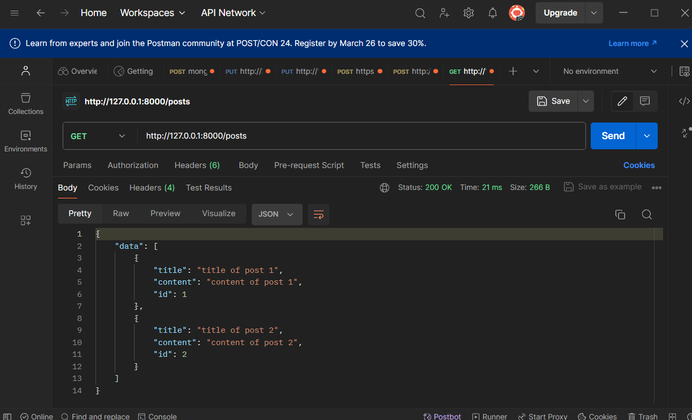

### Setting Up the Environment
`` pip install fastapi uvicorn ``

### Running the API
`` uvicorn main:app --reload ``

### Testing the Endpoints

- **Retrieve All Posts:**  
  Open your web browser or API client and navigate to [http://127.0.0.1:8000/posts](http://127.0.0.1:8000/posts) to retrieve all posts.

- **Create a Post:**  
  Use a POST request with JSON payload to [http://127.0.0.1:8000/posts](http://127.0.0.1:8000/posts) to create a new post.

- **Retrieve Latest Post:**  
  Visit [http://127.0.0.1:8000/posts/latest](http://127.0.0.1:8000/posts/latest) to get the latest post.

- **Retrieve Post by ID:**  
  Access [http://127.0.0.1:8000/posts/{id}](http://127.0.0.1:8000/posts/{id}) to retrieve a specific post by ID.

- **Update Post:**  
  Use a PUT request with JSON payload to [http://127.0.0.1:8000/posts/{id}](http://127.0.0.1:8000/posts/{id}) to update an existing post.

- **Delete Post:**  
  Use a DELETE request to [http://127.0.0.1:8000/posts/{id}](http://127.0.0.1:8000/posts/{id}) to delete a post by ID.

